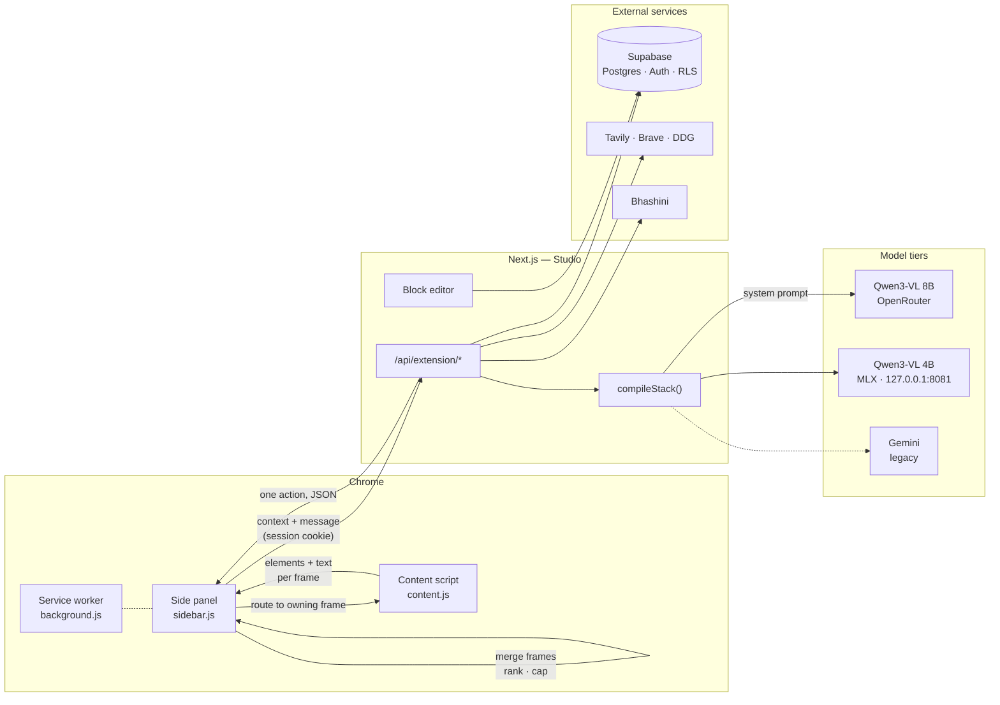

<div align="center">
  

  <h1>CrewBlocks</h1>

  <p><strong>Stack blocks into an agent. Run it inside your browser.</strong></p>

  <p>
    
    
    
    
    
  </p>

  <p>
    <a href="#overview">Overview</a> ·
    <a href="#the-block-system">Blocks</a> ·
    <a href="#architecture">Architecture</a> ·
    <a href="#how-the-agent-sees-a-page">Perception</a> ·
    <a href="#getting-started">Getting Started</a> ·
    <a href="#api-reference">API</a> ·
    <a href="#agent-action-protocol">Action Protocol</a> ·
    <a href="#evaluation">Evaluation</a>
  </p>
</div>

---

## Overview

CrewBlocks pairs a **block editor** with a **Chrome side-panel agent** that acts on real web
pages. You describe an agent as an ordered stack of blocks — what wakes it up, which model it
thinks with, what it must always do, which tools it can reach for, what it remembers — and the
extension picks it up on your next message.

The agent is not limited to conversation. Every turn it receives the active tab's URL, title, text
content, and an indexed map of interactable DOM elements, then replies with a single structured
action: click an element, type into a field, scroll, navigate, search the live web, ask you a
question and wait, translate the page, or answer.

It also knows when *not* to act. A message that is conversation rather than a browser task is
triaged out before any page state is read, so "hi" gets a reply instead of a click.

> The extension is named **CrewAgent** in Chrome. Its source directory is still `BlockAgent/`, and
> the `TOGGLE_BLOCKAGENT` / `SYNC_BLOCKAGENT` window messages keep that name — they are a wire
> contract with the Studio side, documented in `CLAUDE.md`.

**Two deployables, one repository:**

| Package | Role | Stack |
|---|---|---|
| [`Studio/`](Studio/) | Dashboard, block editor, agent runtime, and extension API | Next.js 16 (App Router), React 19, TypeScript, Tailwind v4, Supabase |
| [`BlockAgent/`](BlockAgent/) | Chrome side-panel extension — page context capture and action execution | Chrome Manifest V3, vanilla JS |

---

## The block system

There is no canvas and there are no wires. **Position in the stack is the wiring.** The compiler
walks the stack top to bottom and assembles the system prompt the browser agent runs on.

```
┌──────────────────────────────────────┐
│  ⚡ Trigger        When I message     │   ← what wakes the agent
└──────────────────────────────────────┘
              │
┌──────────────────────────────────────┐
│  ✦ Model          gemini-pro-latest  │   ← the brain, the manner, the looseness
└──────────────────────────────────────┘
              │
┌──────────────────────────────────────┐
│  ✎ Instruction                       │   ← one job per block
│  "Ask before anything that costs."   │
└──────────────────────────────────────┘
              │
┌──────────────────────────────────────┐
│  ⚒ Tool           Shopping           │   ← a capability, with its own details
└──────────────────────────────────────┘
              │
┌──────────────────────────────────────┐
│  ⑂ Condition      If total > 5000    │   ← judged in plain language, not JS
└──────────────────────────────────────┘
              │
┌──────────────────────────────────────┐
│  ▤ Memory         Recalls the last 10│   ← durable context across sessions
└──────────────────────────────────────┘
```

| Block | What it does | One per agent |
|---|---|:--:|
| **Trigger** | When the agent wakes up, and which pages it is scoped to | ✅ |
| **Model** | Which model thinks, its manner, its looseness, its answer style | ✅ |
| **Instruction** | One thing the agent must do. `critical` priority wins any conflict | — |
| **Tool** | A capability — web search, Gmail, shopping, summarising — with its own fields | — |
| **Memory** | How much it recalls, and whether it may write new memories | ✅ |
| **Condition** | Branches behaviour on a situation the model judges from the page | — |
| **Note** | A reminder for you and your squad. Never compiled, never sent | — |

Every block can be **skipped** without deleting it, so you can see the agent with and without a
rule. [`Studio/src/lib/blocks.ts`](Studio/src/lib/blocks.ts) is the single source of truth: the
editor renders from `BLOCK_SPECS`, the API compiles through `compileStack`, and both check
`validateStack`.

### How a stack compiles

`compileStack` emits sections in a deliberate order, because later text loses to earlier text
when a model has to choose:

1. Identity and manner, from the Model block
2. Scope, if the Trigger block names a URL
3. Non-negotiable rules — every `critical` Instruction
4. Tools, with the details you filled in and the workflow each one must complete
5. Normal instructions
6. Branches, from Condition blocks
7. Memory-writing permission

Notes never compile. Skipped blocks never compile.

### Features

- **Reorder by drag or keyboard** — grab the handle, or focus a block and hold <kbd>Alt</kbd> with
  the arrow keys. Focus follows the block it moves.
- **Build with AI** — describe the agent in a sentence and the blocks get written. Everything the
  model returns is rebuilt through `createBlock`, so a malformed field can never reach the stack.
- **Live validation** — a stack with no Model block says so before you try to run it, and each
  block carries its own warning.
- **Realtime collaboration** — Supabase presence puts your squad's initials in the top bar and
  marks the exact block someone else is editing.
- **Autosave** — write-behind on an 800 ms debounce, with the save state stated plainly.

---

## Architecture



**Request lifecycle.**

1. A content script runs in **every frame** and indexes that frame's interactable elements.
2. The side panel enumerates frames, merges their elements into one id space, ranks them and caps
   the table — see [Perception](#how-the-agent-sees-a-page).
3. On a new message it first asks the route to **triage**: conversation, or a browser task — and
   if a task, which **capability** it needs (`email`, `shop`, `search`, …). Only a task starts a
   run, and a task whose capability the current page cannot serve opens a **new tab** first, so
   the page the user was reading is left alone. The capability is resolved to a real site in the
   panel, preferring sites the user already has open.
4. It posts the page context to `/api/extension/chat`. The route loads the agent's stack from
   Supabase, compiles it to a system prompt, and calls the tier the Model block selects.
5. `SEARCH` and `READ_URL` are resolved server-side and fed back to the model, so the panel only
   ever receives a browser action.
6. The action returns as strict JSON and is dispatched to the frame that owns the target element.

The loop is bounded — step budget, working-time budget, repeated-state detection — and irreversible
clicks are gated in code rather than in the prompt. `model.md` §4 and §7 carry the reasoning.

### Repository layout

```
crewblocks/
├── Studio/                         # Next.js dashboard + API
│   └── src/
│       ├── app/
│       │   ├── api/
│       │   │   ├── chat/           # Generic multi-provider chat proxy
│       │   │   └── extension/      # Extension bridge
│       │   │       ├── chat/       # Compiles the stack, runs the turn
│       │   │       ├── models/     # Agents available to the user (incl. squads)
│       │   │       ├── history/    # Transcript read + reset
│       │   │       ├── memory/     # Durable agent memory
│       │   │       └── translate/  # Bhashini translation pipeline
│       │   ├── agent/[id]/         # The block editor
│       │   └── dashboard/          # Agents, keys, squads, marketplace, settings
│       ├── components/
│       │   ├── blocks/             # BlockStackEditor · BlockCard · BlockBody · AddBlockMenu
│       │   ├── dashboard/          # Dashboard surfaces and marketplace
│       │   └── ui/                 # shadcn-style primitives
│       ├── lib/
│       │   ├── blocks.ts           # Block model, tool library, validator, compiler
│       │   ├── providers.ts        # Model id → cloud / on-device / Gemini routing
│       │   └── search.ts           # Tavily · Brave · DuckDuckGo behind one interface
│       ├── utils/supabase/         # Browser, server, and middleware clients
│       └── middleware.ts           # Session refresh + route protection
│   └── supabase/schema.sql         # Tables, RLS policies, helper functions — run once
│
├── BlockAgent/                     # Chrome MV3 extension — ships as "CrewAgent"
│   ├── manifest.json               # Permissions, side panel, all_frames content script
│   ├── background.js               # Service worker — opens the side panel
│   ├── content.js                  # Element extraction + action execution, per frame
│   ├── sidebar.{html,css,js}       # Side panel UI, agent loop, frame merge, API client
│   └── vendor/                     # marked · highlight.js · DOMPurify
│
├── eval/                           # Extractor golden set — open index.html in Chrome
│   ├── index.html                  # Runner; loads the real extractor, no keys needed
│   └── fixtures/                   # Recorded pages + their expectations
│
├── scripts/                        # dev.sh · model-server.sh · setup-model.sh
└── model.md                        # Every model and perception decision, with reasons
```

---

## How the agent sees a page

The model never sees raw HTML. It sees a table of elements, and the quality of that table decides
almost everything — three separate failures that looked like model weakness turned out to be the
table. `model.md` §2.1 has the measurements; this is the shape.

```
content.js, in every frame
  ├─ labelFor()      accessible name first: aria-labelledby → aria-label →
  │                  placeholder → title → alt → value → name → id
  ├─ kindOf()        by accepted action, not tag: a text box is "input",
  │                  a submit button and a checkbox are "clickable"
  ├─ isActionable()  needs a real signal — interactive tag, ARIA role,
  │                  onclick, contenteditable, or cursor:pointer.
  │                  Rejects pointer-events:none, aria-disabled, wrappers
  └─ isOccluded()    elementFromPoint at the box centre; anything painted
                     over is dropped, so the agent is not offered a button
                     sitting under a cookie banner

sidebar.js, once per turn
  ├─ merge frames    every frame numbers from 1; the panel renumbers into one
  │                  sequence and remembers globalId → {frameId, localId}
  ├─ elementRank()   inputs, then short-labelled controls, then content links,
  │                  then images
  └─ cap at 200      ranked first, so the Send button survives the cut
```

Each element reaches the model as `{ id, kind, text | name, type?, role? }`. Bounding boxes are
stripped — they exist only so the panel can paint Set-of-Mark badges onto a screenshot when the
Vision block asks for one.

**Why the `kind` field earns its place.** Without it, `CLICK` on a search box looks as reasonable
to the model as `TYPE`. Clicking a text field changes nothing, the page state hash is unchanged,
and the loop guard fires — which reads in the transcript as the model being stupid.

---

## Getting Started

### Prerequisites

- Node.js 20+ and **pnpm** (never `npm install` in this repo)
- A Supabase project (Postgres + Auth)
- Google Chrome
- An OpenRouter key for the cloud tier — *or* Python 3.11+ and ~4 GB free RAM for the on-device one

### 1. Create the database

Open your Supabase project → **SQL Editor** → paste [`Studio/supabase/schema.sql`](Studio/supabase/schema.sql)
→ Run. It is idempotent, so it is safe to re-run.

This creates 9 tables, enables RLS on every one of them, and adds the two `SECURITY DEFINER` helper
functions squad visibility needs. **Skipping it is the single most common setup failure** — auth
succeeds, then every query returns `PGRST205: Could not find the table`.

### 2. Configure the studio

```bash
pnpm install
```

Create `Studio/.env.local`:

```bash
NEXT_PUBLIC_SUPABASE_URL=your-project-url
NEXT_PUBLIC_SUPABASE_ANON_KEY=your-anon-key

# Cloud model tier
OPENROUTER_API_KEY=your-openrouter-key

# Optional
LOCAL_MODEL_URL=http://127.0.0.1:8081/v1   # on-device tier, if not the default
TAVILY_API_KEY=your-tavily-key             # web search; Brave and DDG also supported
BHASHINI_SUBSCRIPTION_KEY=your-bhashini-key
NEXT_PUBLIC_DEV_AUTH_BYPASS=1              # local only — fakes a signed-in user
```

| Variable | Required | Purpose |
|---|:--:|---|
| `NEXT_PUBLIC_SUPABASE_URL` | ✅ | Supabase project endpoint |
| `NEXT_PUBLIC_SUPABASE_ANON_KEY` | ✅ | Public client key; RLS enforces access |
| `OPENROUTER_API_KEY` | ◐ | Cloud tier. Not needed if you only run on-device |
| `TAVILY_API_KEY` | — | Web search. Falls back to Brave, then DuckDuckGo |
| `BHASHINI_SUBSCRIPTION_KEY` | — | Page translation pipeline |
| `LOCAL_MODEL_URL` | — | Overrides where the on-device server is expected |

> **Gemini keys are not environment variables.** The legacy Gemini path reads a per-user key from
> **Dashboard → API Keys**, stored against the account under RLS.

### 3. Run it

```bash
pnpm dev        # Studio + the on-device model server; Ctrl-C stops both
pnpm dev:ui     # Studio only — cloud tier, no local model
pnpm dev:model  # the model server on its own
pnpm setup:model  # one-time: venv + mlx-vlm + weights (~2.5 GB)
```

The studio is served at `http://localhost:3000`. Sign up, then create an agent and stack its
blocks — or describe it and let the composer write them.

### 4. Load the extension

1. Visit `chrome://extensions/`.
2. Enable **Developer mode** (top right).
3. Click **Load unpacked** and select the [`BlockAgent/`](BlockAgent/) directory.
4. Pin **CrewAgent** from the extensions menu.

The side panel targets the hosted API at `https://crewblocks.vercel.app/api/extension` by default
and switches to `http://localhost:3000/api/extension` automatically when the active tab is on
localhost. Because requests carry your session cookie, stay signed in to the same origin you are
pointing at.

### 5. Drive the agent

Open the side panel, pick your agent from the dropdown, and issue commands:

```text
Scroll down a bit
Search for laptops in the search bar
Go to amazon and find formal shoes under 1000
Translate this page to Hindi
Summarise what this page is about
```

Use the **Cloud / Local** toggle in the header to move a single run on-device without editing the
agent. Cloud is both faster and stronger; local is for when nothing may leave the machine.

---

## Data model

An agent row stores its stack as JSON:

```json
{
  "version": 2,
  "blocks": [
    { "id": "trigger-a1b2", "kind": "trigger", "title": "Trigger", "enabled": true,
      "when": "message", "urlContains": "amazon.in" },
    { "id": "model-c3d4", "kind": "model", "title": "Model", "enabled": true,
      "model": "gemini-pro-latest", "tone": "Direct and brief",
      "temperature": 0.7, "responseFormat": "markdown" }
  ]
}
```

`readStack()` accepts either a stack or a legacy node-graph payload, flattening the latter into
blocks so older rows keep working.

Postgres tables in use: `chatflows` (agents), `chat_history`, `chatflow_memory`, `apiKeys`,
`squads`, `squad_members`, `squad_chatflows`, `marketplace_workflows`, `marketplace_ratings`.
RLS scopes every one of them to the signed-in user.

---

## API Reference

All extension routes require an authenticated Supabase session and return `401` without one.

| Method | Endpoint | Description |
|---|---|---|
| `POST` | `/api/extension/chat` | Compiles the agent's stack, runs one turn, returns one action as JSON |
| `POST` | `/api/extension/chat` + `mode: "triage"` | Cheap text-only turn: browser task or conversation, and which capability it needs |
| `GET` | `/api/extension/models` | Lists agents owned by the user and shared via squads |
| `GET` | `/api/extension/history` | Returns up to 100 messages for an agent, oldest first |
| `DELETE` | `/api/extension/history` | Clears an agent's transcript and memory |
| `GET` | `/api/extension/memory` | Returns the most recent memories for an agent |
| `POST` | `/api/extension/translate` | Translates text nodes via Bhashini, 50 per call, 6 calls in flight |
| `POST` | `/api/chat` | Provider-agnostic chat proxy — Gemini, OpenAI, or Anthropic |

---

## Agent Action Protocol

The agent replies with a single JSON object per turn — one action at a time.

| Action | Required fields | Effect |
|---|---|---|
| `CLICK` | `elementId` | Clicks the element. Only ids with `kind: "clickable"` |
| `TYPE` | `elementId`, `text` | Types into an `kind: "input"` field. `submit: true` presses Enter |
| `SCROLL` | `direction` (`UP` \| `DOWN`) | Scrolls the window |
| `NAVIGATE` | `url` | Navigates the tab, subject to the domain allowlist |
| `TRANSLATE` | `language` | Translates page text nodes (`as`, `bn`, `brx`, `hi`, `en`) |
| `SEARCH` | `query` | Live web search. Resolved server-side, never reaches the panel |
| `READ_URL` | `url` | Extracts one page's text. Also server-side |
| `SEE` | `text` | Requests a screenshot, with a reason. Capped at 3 per run |
| `ASK` | `text` | **Suspends** the run and waits for you. Resumes with your reply |
| `ANSWER` | `text` | Ends the run |

`ASK` takes an `expecting` field that shapes the control the panel renders — `confirmation`,
`choice` (with `options`), `otp`, `number`, or `text`. A suspended run keeps its budgets; the clock
stops while it waits for a person.

Two optional fields may accompany any action: `memory`, persisted when a Memory block allows
writes, and `usedTool`, which surfaces the tool credited for the turn in the UI.

```json
{ "action": "TYPE", "elementId": 12, "text": "formal shoes", "submit": true }
{ "action": "ASK", "text": "Place the order for ₹2,499?", "expecting": "confirmation" }
```

**Two guards do not depend on the model choosing to use them.** Before any `CLICK` in `supervised`
mode the panel matches the *target element's own label* against an irreversible-action pattern —
buy, pay, place order, delete, transfer — and suspends for a confirmation whatever the model
intended. And the content script refuses `CLICK` or `TYPE` on a password or card-number field in
every mode. `model.md` §7 has the measurements that made both necessary.

---

## Model Providers

One open-weight family, two tiers. Both speak an OpenAI-compatible API, so moving between them is
a base-URL change and nothing else in the app moves.

| Tier | Model | Runtime | When |
|---|---|---|---|
| **Cloud** | `qwen/qwen3-vl-8b-instruct` | OpenRouter | Default. Faster *and* stronger |
| **On-device** | `mlx-community/Qwen3-VL-4B-Instruct-4bit` | `mlx_vlm.server` on `127.0.0.1:8081` | Nothing leaves the machine |
| **Legacy** | `gemini-flash-latest`, `gemini-pro-latest` | `@google/genai` | Existing agents keep working |

Cloud being *faster* than local is worth saying out loud: the on-device tier buys privacy, not
speed. Sizes differ because the machines do — `model.md` §1 has the memory budget behind 8B/4B.

Routing lives in [`Studio/src/lib/providers.ts`](Studio/src/lib/providers.ts); the model-id prefix
picks the client. Web search runs through **Tavily**, with Brave and DuckDuckGo behind the same
interface. Translation runs on the **Bhashini** Dhruva pipeline.

---

## Evaluation

```bash
python3 -m http.server 8000     # from the repo root
open http://localhost:8000/eval/index.html
```

No model, no keys, no network. The runner fetches the shipped `content.js` and `sidebar.js` and
executes the **real** `extractContext` and `elementsForModel` against recorded pages — so it cannot
pass against code the extension does not run.

Cases are named by the **DOM pattern** they exercise, not by the site they came from — the point
is that any page with that shape works, not that these nine do.

| Case | Guards against |
|---|---|
| Compose and send | the Send button falling off the end of the element budget |
| Search from the box | typing and clicking being indistinguishable |
| Cookie banner covering the page | offering controls that are painted over |
| Form labelled the standard HTML way | `<label for>` being ignored, so fields arrive named `f_2` |
| Controls inside a web component | `querySelectorAll` stopping at a shadow boundary |
| Action bar pinned to the viewport | `position: fixed` controls read as invisible |
| Buttons with icons and no text | a control whose only name is `aria-label` or `title` |
| Hand-rolled dropdown, disabled controls | offering dead controls as targets |
| Long result list with controls at the end | ranking running after the cap instead of before |

Capability routing has its own runner, same principle — it extracts `resolveCapability` out of the
shipped `sidebar.js` rather than importing a copy:

```bash
node eval/routing.test.mjs
```

| Case | Guards against |
|---|---|
| No mail tab open | a capability with no default |
| Outlook open, Gmail not | assuming everyone uses Gmail |
| User named an unknown site | a bare name never becoming a host |
| `search` / `video` with a query | an unencoded query string |

And model reply parsing, which decides whether a run survives an off-format turn:

```bash
node eval/json-parse.test.mjs
```

| Case | Guards against |
|---|---|
| `<think>` trace before the action | reasoning braces being read as the payload |
| Prose containing braces | slicing from the first `{` to the last `}` |
| Truncated mid-string | a half-JSON reply becoming a confidently wrong action |

And field state, which decides whether the agent can see the effect of its own typing:

```bash
node eval/field-state.test.mjs
```

| Case | Guards against |
|---|---|
| Filled vs empty field | a successful TYPE looking identical to no TYPE |
| Password / card-number field | a secret being shipped to the model for being on the page |
| Signature moves when typed into | a filled form counting as "the page did not change" |

Each fixture declares its own expectations in a JSON block — which labels must reach the model,
with which `kind`, and which junk must not. Adding a case is one HTML file in `eval/fixtures/`.

It earned its place on the first run by catching `<input type="submit">` being classified as
`kind: "input"`, which would have told the model to type into a Send button.

**What it does not cover yet:** it measures the element table, not the model. Running the 4B and 8B
tiers against the same fixtures with known-correct actions is the other half, and it is what any
honest "is the model too small" answer needs.

---

## Security Notes

- The extension requests `<all_urls>` host permissions and injects a content script into **every
  frame** of every page — necessary for page-level actions, and worth understanding before
  installing.
- Page content is transmitted to the backend and on to the model provider on every turn, unless you
  are on the on-device tier, where nothing leaves the machine. Close the side panel on sensitive
  pages, or switch the header toggle to **Local**.
- **Screenshot redaction is specified but not yet implemented.** The cloud tier currently sends the
  marked screenshot unredacted when the Vision block asks for one. See `model.md` §8 and §11.
- Tool blocks can hold payment details. They are stored per user under RLS and only ever reach the
  model provider, but treat an agent you publish or share as if its tool config is visible.
- The agent never fabricates OTPs and never attempts CAPTCHAs; both are escalated to you via `ASK`.
- Password and card-number fields are refused by the content script in every autonomy mode. This is
  a per-action refusal, not a page-level kill switch, so login flows still work.
- A live Bhashini subscription key is currently committed as a hardcoded fallback in
  `translate/route.ts`. Put a real key in `.env.local`, delete the literal, and rotate it.
- Model keys live in Supabase under the signed-in account, never in the extension bundle.
- Rendered markdown is sanitised with DOMPurify before it reaches the DOM.

---

<div align="center">
  <strong>CrewBlocks</strong> — stack it, then let it work.
  <br />
  <sub>Every model and perception decision, with the reason it beat the alternative: <a href="model.md">model.md</a></sub>
</div>
