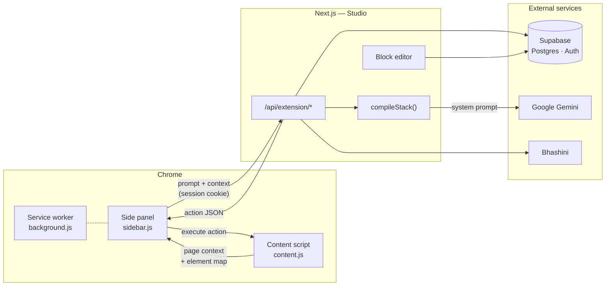

<div align="center">
  

  <h1>CrewBlocks</h1>

  <p><strong>Stack blocks into an agent. Run it inside your browser.</strong></p>

  <p>
    
    
    
    
    
  </p>

  <p>
    <a href="#overview">Overview</a> ·
    <a href="#the-block-system">Blocks</a> ·
    <a href="#architecture">Architecture</a> ·
    <a href="#getting-started">Getting Started</a> ·
    <a href="#api-reference">API</a> ·
    <a href="#agent-action-protocol">Action Protocol</a>
  </p>
</div>

---

## Overview

CrewBlocks pairs a **block editor** with a **Chrome side-panel agent** that acts on real web
pages. You describe an agent as an ordered stack of blocks — what wakes it up, which model it
thinks with, what it must always do, which tools it can reach for, what it remembers — and the
extension picks it up on your next message.

The agent is not limited to conversation. Every turn it receives the active tab's URL, title, text
content, and an indexed map of interactable DOM elements, then replies with a single structured
action: click an element, type into a field, scroll, navigate, translate the page, or answer.

**Two deployables, one repository:**

| Package | Role | Stack |
|---|---|---|
| [`Studio/`](Studio/) | Dashboard, block editor, agent runtime, and extension API | Next.js 16 (App Router), React 19, TypeScript, Tailwind v4, Supabase |
| [`BlockAgent/`](BlockAgent/) | Chrome side-panel extension — page context capture and action execution | Chrome Manifest V3, vanilla JS |

---

## The block system

There is no canvas and there are no wires. **Position in the stack is the wiring.** The compiler
walks the stack top to bottom and assembles the system prompt the browser agent runs on.

```
┌──────────────────────────────────────┐
│  ⚡ Trigger        When I message     │   ← what wakes the agent
└──────────────────────────────────────┘
              │
┌──────────────────────────────────────┐
│  ✦ Model          gemini-pro-latest  │   ← the brain, the manner, the looseness
└──────────────────────────────────────┘
              │
┌──────────────────────────────────────┐
│  ✎ Instruction                       │   ← one job per block
│  "Ask before anything that costs."   │
└──────────────────────────────────────┘
              │
┌──────────────────────────────────────┐
│  ⚒ Tool           Shopping           │   ← a capability, with its own details
└──────────────────────────────────────┘
              │
┌──────────────────────────────────────┐
│  ⑂ Condition      If total > 5000    │   ← judged in plain language, not JS
└──────────────────────────────────────┘
              │
┌──────────────────────────────────────┐
│  ▤ Memory         Recalls the last 10│   ← durable context across sessions
└──────────────────────────────────────┘
```

| Block | What it does | One per agent |
|---|---|:--:|
| **Trigger** | When the agent wakes up, and which pages it is scoped to | ✅ |
| **Model** | Which model thinks, its manner, its looseness, its answer style | ✅ |
| **Instruction** | One thing the agent must do. `critical` priority wins any conflict | — |
| **Tool** | A capability — web search, Gmail, shopping, summarising — with its own fields | — |
| **Memory** | How much it recalls, and whether it may write new memories | ✅ |
| **Condition** | Branches behaviour on a situation the model judges from the page | — |
| **Note** | A reminder for you and your squad. Never compiled, never sent | — |

Every block can be **skipped** without deleting it, so you can see the agent with and without a
rule. [`Studio/src/lib/blocks.ts`](Studio/src/lib/blocks.ts) is the single source of truth: the
editor renders from `BLOCK_SPECS`, the API compiles through `compileStack`, and both check
`validateStack`.

### How a stack compiles

`compileStack` emits sections in a deliberate order, because later text loses to earlier text
when a model has to choose:

1. Identity and manner, from the Model block
2. Scope, if the Trigger block names a URL
3. Non-negotiable rules — every `critical` Instruction
4. Tools, with the details you filled in and the workflow each one must complete
5. Normal instructions
6. Branches, from Condition blocks
7. Memory-writing permission

Notes never compile. Skipped blocks never compile.

### Features

- **Reorder by drag or keyboard** — grab the handle, or focus a block and hold <kbd>Alt</kbd> with
  the arrow keys. Focus follows the block it moves.
- **Build with AI** — describe the agent in a sentence and the blocks get written. Everything the
  model returns is rebuilt through `createBlock`, so a malformed field can never reach the stack.
- **Live validation** — a stack with no Model block says so before you try to run it, and each
  block carries its own warning.
- **Realtime collaboration** — Supabase presence puts your squad's initials in the top bar and
  marks the exact block someone else is editing.
- **Autosave** — write-behind on an 800 ms debounce, with the save state stated plainly.

---

## Architecture



**Request lifecycle.** The content script indexes interactable elements and extracts page text. The
side panel posts that context with your message to `/api/extension/chat`. The route loads the
agent's block stack from Supabase, compiles it into a system prompt, loads your Gemini key and any
stored memories, then calls Gemini. The response — strict JSON — returns to the side panel, which
dispatches the action to the content script.

### Repository layout

```
crewblocks/
├── Studio/                         # Next.js dashboard + API
│   └── src/
│       ├── app/
│       │   ├── api/
│       │   │   ├── chat/           # Generic multi-provider chat proxy
│       │   │   └── extension/      # Extension bridge
│       │   │       ├── chat/       # Compiles the stack, runs the turn
│       │   │       ├── models/     # Agents available to the user (incl. squads)
│       │   │       ├── history/    # Transcript read + reset
│       │   │       ├── memory/     # Durable agent memory
│       │   │       └── translate/  # Bhashini translation pipeline
│       │   ├── agent/[id]/         # The block editor
│       │   └── dashboard/          # Agents, keys, squads, marketplace, settings
│       ├── components/
│       │   ├── blocks/             # BlockStackEditor · BlockCard · BlockBody · AddBlockMenu
│       │   ├── dashboard/          # Dashboard surfaces and marketplace
│       │   └── ui/                 # shadcn-style primitives
│       ├── lib/
│       │   └── blocks.ts           # Block model, tool library, validator, compiler
│       ├── utils/supabase/         # Browser, server, and middleware clients
│       └── middleware.ts           # Session refresh + route protection
│
└── BlockAgent/                     # Chrome MV3 extension
    ├── manifest.json               # Permissions, side panel, content scripts
    ├── background.js               # Service worker — opens the side panel
    ├── content.js                  # DOM extraction + action execution
    ├── sidebar.{html,css,js}       # Side panel UI and API client
    └── vendor/                     # marked · highlight.js · DOMPurify
```

---

## Getting Started

### Prerequisites

- Node.js 20+ and pnpm
- A Supabase project (Postgres + Auth)
- A Google Gemini API key
- Google Chrome

### 1. Configure the studio

```bash
cd Studio
pnpm install
```

Create `Studio/.env.local`:

```bash
NEXT_PUBLIC_SUPABASE_URL=your-project-url
NEXT_PUBLIC_SUPABASE_ANON_KEY=your-anon-key

# Optional — server-side translation and provider keys
BHASHINI_SUBSCRIPTION_KEY=your-bhashini-key
SARVAM=your-sarvam-key
```

| Variable | Required | Purpose |
|---|:--:|---|
| `NEXT_PUBLIC_SUPABASE_URL` | ✅ | Supabase project endpoint |
| `NEXT_PUBLIC_SUPABASE_ANON_KEY` | ✅ | Public client key; RLS enforces access |
| `BHASHINI_SUBSCRIPTION_KEY` | — | Page translation pipeline |
| `SARVAM` | — | Sarvam AI access |

> **Model keys are not environment variables.** Provider keys are added per user in
> **Dashboard → API Keys** and stored against the account, so the extension ships with no
> credentials of its own.

### 2. Run it

```bash
pnpm dev
```

The studio is served at `http://localhost:3000`. Sign up, then:

1. Open **API Keys** and add your Gemini key.
2. Create an agent and stack its blocks — or describe it and let the composer write them.

### 3. Load the extension

1. Visit `chrome://extensions/`.
2. Enable **Developer mode** (top right).
3. Click **Load unpacked** and select the [`BlockAgent/`](BlockAgent/) directory.
4. Pin **CrewBlocks** from the extensions menu.

The side panel targets the hosted API at `https://crewblocks.vercel.app/api/extension` by default
and switches to `http://localhost:3000/api/extension` automatically when the active tab is on
localhost. Because requests carry your session cookie, stay signed in to the same origin you are
pointing at.

### 4. Drive the agent

Open the side panel, pick your agent from the dropdown, and issue commands:

```text
Scroll down a bit
Click the sign in button
Search for laptops in the search bar
Translate this page to Hindi
Summarise what this page is about
```

---

## Data model

An agent row stores its stack as JSON:

```json
{
  "version": 2,
  "blocks": [
    { "id": "trigger-a1b2", "kind": "trigger", "title": "Trigger", "enabled": true,
      "when": "message", "urlContains": "amazon.in" },
    { "id": "model-c3d4", "kind": "model", "title": "Model", "enabled": true,
      "model": "gemini-pro-latest", "tone": "Direct and brief",
      "temperature": 0.7, "responseFormat": "markdown" }
  ]
}
```

`readStack()` accepts either a stack or a legacy node-graph payload, flattening the latter into
blocks so older rows keep working.

Postgres tables in use: `chatflows` (agents), `chat_history`, `chatflow_memory`, `apiKeys`,
`squads`, `squad_members`, `squad_chatflows`, `marketplace_workflows`, `marketplace_ratings`.
RLS scopes every one of them to the signed-in user.

---

## API Reference

All extension routes require an authenticated Supabase session and return `401` without one.

| Method | Endpoint | Description |
|---|---|---|
| `POST` | `/api/extension/chat` | Compiles the agent's stack, runs one turn, returns one action as JSON |
| `GET` | `/api/extension/models` | Lists agents owned by the user and shared via squads |
| `GET` | `/api/extension/history` | Returns up to 100 messages for an agent, oldest first |
| `DELETE` | `/api/extension/history` | Clears an agent's transcript and memory |
| `GET` | `/api/extension/memory` | Returns the most recent memories for an agent |
| `POST` | `/api/extension/translate` | Translates text nodes via Bhashini, batched 50 per call |
| `POST` | `/api/chat` | Provider-agnostic chat proxy — Gemini, OpenAI, or Anthropic |

---

## Agent Action Protocol

The agent replies with a single JSON object per turn — one action at a time.

| Action | Required fields | Effect |
|---|---|---|
| `CLICK` | `elementId` | Clicks the indexed element |
| `TYPE` | `elementId`, `text` | Types into the indexed field |
| `SCROLL` | `direction` (`UP` \| `DOWN`) | Scrolls the window |
| `NAVIGATE` | `url` | Navigates the tab |
| `TRANSLATE` | `language` | Translates page text nodes (`as`, `bn`, `brx`, `hi`, `en`) |
| `ANSWER` | `text` | Replies to the user, or requests input such as an OTP |

Two optional fields may accompany any action: `memory`, persisted when a Memory block allows
writes, and `usedTool`, which surfaces the tool credited for the turn in the UI.

```json
{ "action": "TYPE", "elementId": 12, "text": "laptops", "usedTool": "Shopping" }
```

---

## Model Providers

| Provider | Where it is used |
|---|---|
| **Google Gemini** | Powers the browser agent, including the Google Search grounding tool |
| **Sarvam AI** | Selectable provider in the dashboard key vault |
| **Groq** | Selectable provider in the dashboard key vault |
| **OpenAI · Anthropic** | Supported by the generic `/api/chat` proxy |

Translation runs on the **Bhashini** Dhruva inference pipeline.

---

## Security Notes

- The extension requests `<all_urls>` host permissions and injects a content script everywhere —
  necessary for page-level actions, and worth understanding before installing.
- Page content is transmitted to the backend and on to the model provider on every turn. Close the
  side panel on sensitive pages.
- Tool blocks can hold payment details. They are stored per user under RLS and only ever reach the
  model provider, but treat an agent you publish or share as if its tool config is visible.
- The agent never fabricates OTPs and never attempts CAPTCHAs; both are escalated to you.
- Model keys live in Supabase under the signed-in account, never in the extension bundle.
- Rendered markdown is sanitised with DOMPurify before it reaches the DOM.

---

<div align="center">
  <strong>CrewBlocks</strong> — stack it, then let it work.
</div>
